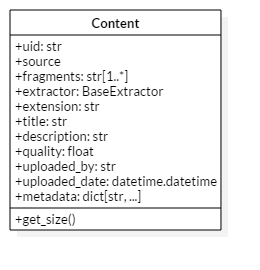
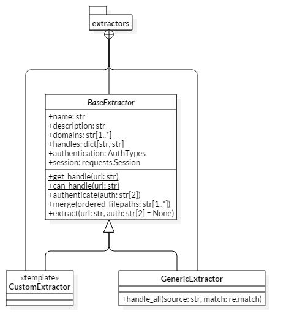
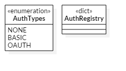
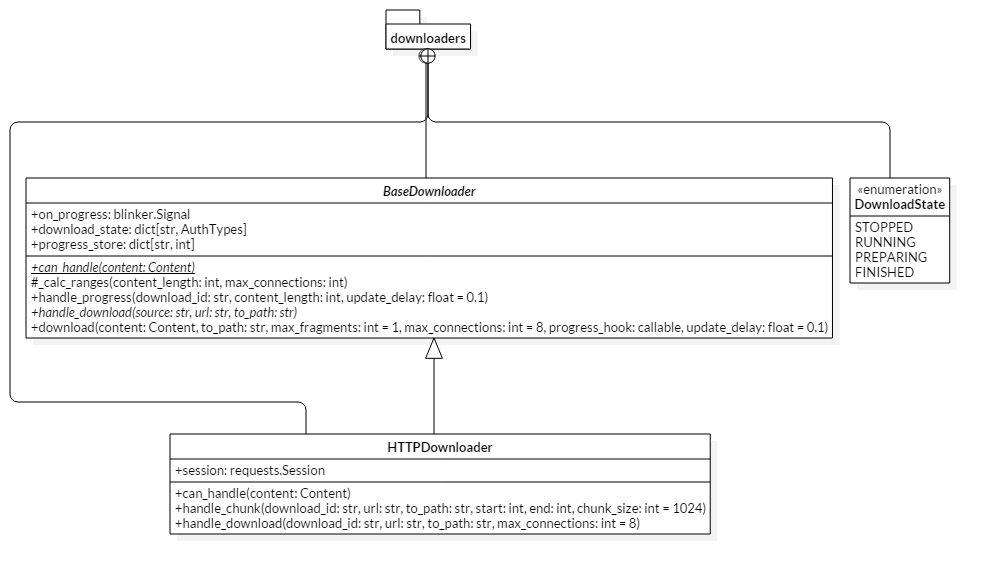
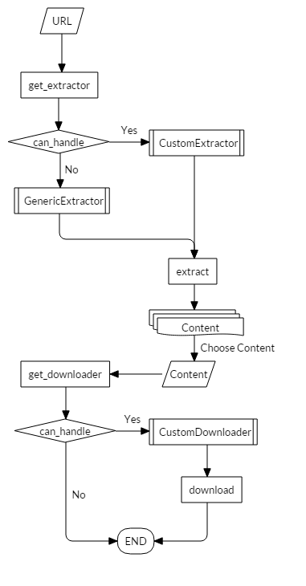

=================
Project Structure
=================

*I like pictures*, so bear with me while I use a couple that some of you might *roll* your eyes at.

Qetch mainly consists of 4 separate components.
These are listed in the following sections with a quick and simple description of each one and what it's purpose is.

Content
-------
The :class:`~qetch.content.Content` is a simple object which stores all the required information needed to download something.

Most of the attributes in this object is sugar used for better representing the content.
The only three that really matter are the :attr:`~qetch.content.Content.uid`, :attr:`~qetch.content.Content.extractor`, and :attr:`~qetch.content.Content.fragments`.

The :attr:`~qetch.content.Content.uid` is simply a unique identifier for the content.
The :attr:`~qetch.content.Content.extractor` is just a reference to the :class:`~qetch.extractors._common.BaseExtractor` subclass that was used to extract the content.

The actual urls which need to be downloaded to form the full content are items in the :attr:`~qetch.content.Content.fragments` list.
In most cases the length of this list is 1 (because the raw content is not hosted as segments).
*However*, for sites that do stream segments of media, it most likely means that the length of the :attr:`~qetch.content.Content.fragments` list will be more than one.

Because of these fragments, it is necessary to calculate the size of the full content.
This is performed through the :func:`~qetch.content.Content.get_size` method.

Extractors
----------
All extractors are subclasses of :class:`~qetch.extractors._common.BaseExtractor`, and provide special logic to handle the extraction of certain URLs.
This usually means that a handled domain will have an extractor to deal with that domain's URLs.

This is essentially the core of the project since it requires contributions from the community to grow and include the ability for difference domains to have their content extracted.
*If you have the logic to create an extractor for a domain that is not yet handled*, please make a pull request following :doc:`our guidelines <./contributing>`.

The overall purpose of extractors is to yield one or more list of :class:`~qetch.content.Content` instances that can be downloaded from a given URL.

The reason extractors yeild **lists** is because a site might host various levels of quality for some content that is essentially the same.
This allows the user to choose which quality of content they want from the available qualities found at the given URL.

Authentication
''''''''''''''
Sometimes there is no **good** way to retrieve the necessary information for a certain URL due to authentication requirements by the site itself.
In order to handle this, the :class:`~qetch.auth.AuthRegistry` was created to help extractors say what kind of authentication is required before they can extract content.

An extractor specifies the necessary :class:`~qetch.auth.AuthTypes` literal in the :attr:`~qetch.extractors._common.BaseExtractor.authentication` property.
It applies any authentication in the :func:`~qetch.extractors._common.BaseExtractor.authenticate` method before extraction.

The :class:`~qetch.auth.AuthRegistry` is a borg dictionary which stores authentication information across all instances of the registry.

Downloaders
-----------
Downloaders are similaraly structured to extractors, but their purpose is to download a single :class:`~qetch.content.Content` instance to a specified filepath.
They all extend :class:`~qetch.downloaders._common.BaseDownloader` and provide progress hooks to the download process.

All of the downloaders *should* support multi-threaded/multi-connection downloads similar to the :class:`~qetch.downloaders.http.HTTPDownloader`.

The optional merging of fragments is handled by the extractor itself in the :func:`~qetch.extractors._common.BaseExtractor.merge` (since downloader's are abstracted away from extraction).
If the extractor does require downloaded fragment merging, then it is necessary for the extractor to override that method.

Basic Overview
--------------
Just to visualize the overall process involved in downloading a URL from start to finish, here is a simple flow chart describing the process.

